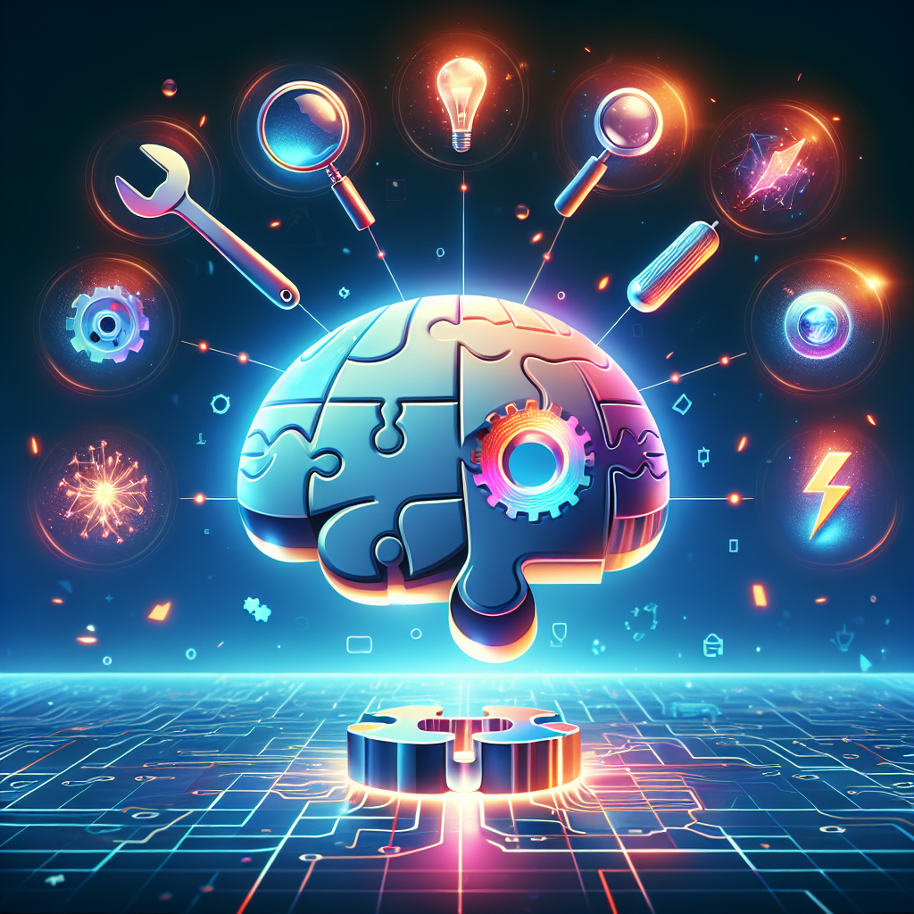
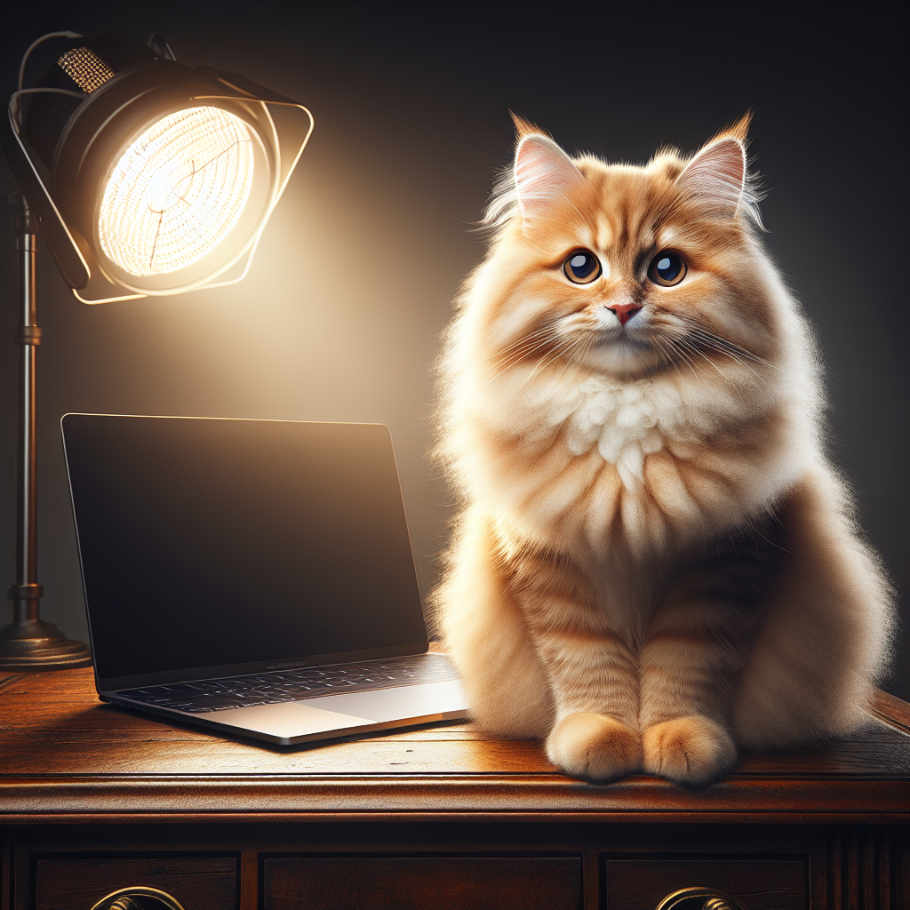

# openclaw-image-skill

An [OpenClaw](https://github.com/ElSpaniard97) agent skill for generating images via OpenAI's DALL-E 3 API.

## What It Does

Give it a text prompt, get a PNG. The skill handles the API call, JSON parsing, and image download in one shot.

## Requirements

- `curl`
- `python3` (stdlib only — used for JSON escaping and parsing)
- `jq` (optional — python3 is the fallback)
- An OpenAI API key with image generation access

## Quick Start

```bash
export OPENAI_API_KEY=sk-proj-...
./scripts/generate.sh "a glowing robot holding a paintbrush" output.png
```

## Usage

```
./scripts/generate.sh "<prompt>" <output_path> [size] [quality]
```

| Argument | Required | Default | Options |
|---|---|---|---|
| prompt | Yes | — | Any text description |
| output_path | Yes | — | e.g. `cat.png`, `/tmp/result.png` |
| size | No | `1024x1024` | `1024x1024`, `1792x1024`, `1024x1792` |
| quality | No | `standard` | `standard`, `hd` |

## Sample Images

Generated images included in this repo:

### What is a Skill?

> A glowing modular puzzle piece slotting into a robot brain, surrounded by floating tool icons.

### Cat

> A fluffy orange tabby cat sitting on a wooden desk next to a glowing laptop.

## File Structure

```
openclaw-image-skill/
  SKILL.md              # Agent skill spec
  README.md             # This file
  scripts/
    generate.sh         # Image generation script
  images/
    skill-concept.png   # Sample: visualization of an AI skill
    cat.png             # Sample: generated cat photo
```

## Security

- Never hardcode your API key — use the `OPENAI_API_KEY` env var
- Generated image URLs from OpenAI expire after ~2 hours; the downloaded file is permanent
- Rotate your key if it's ever exposed in a public channel or repo
